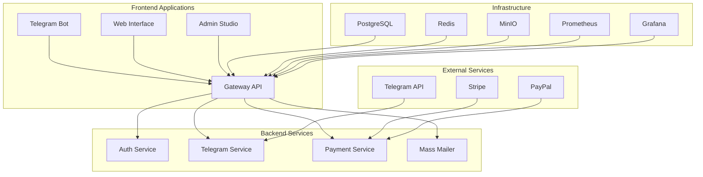

# Tele•Ga Platform

[](https://opensource.org/licenses/MIT)
[](https://github.com/your-username/telega-platform-1/actions/workflows/ci.yml)
[](https://github.com/your-username/telega-platform-1/actions/workflows/deploy.yml)
[](https://hub.docker.com/r/your-username/telega)
[](https://kubernetes.io/)
[](https://helm.sh/)
[](https://t.me/TeleGaSupportBot)
[](https://t.me/Tele_GaCommunity)
[](https://github.com/your-username/telega-platform-1)
[](https://www.typescriptlang.org/)
[](https://nestjs.com/)
[](https://reactjs.org/)

🚀 **Мощная Telegram e-commerce платформа** с мультиботами, маркетплейсом и кастомным UI.

**Live Demo**: [shop.telega.uz](https://shop.telega.uz) | [studio.telega.uz](https://studio.telega.uz) | [api.telega.uz](https://api.telega.uz)

---

## 🔧 Стек технологий

- **Backend**: NestJS 11 (monorepo, microapps)
- **Telegram**: Telegraf.js + Webhook/LongPolling
- **ORM**: TypeORM 3 / PostgreSQL
- **Frontend**: Vite + React + TailwindCSS
- **DevOps**: Docker, Kubernetes, Helm
- **Монета**: Teleton (внутренняя единица расчёта)
- **Хранилище**: MinIO (совместим с S3)
- **Мониторинг**: Prometheus + Grafana
- **Логирование**: ELK Stack

## 🏗️ Архитектура

Проект использует **микросервисную архитектуру** с **монорепозиторием**:



### Основные компоненты:

- **Gateway**: API Gateway на NestJS
- **Telegram Service**: Обработка Telegram ботов
- **Auth Service**: Аутентификация и авторизация
- **Payment Service**: Интеграция с платежными системами
- **Frontend Interface**: Пользовательский интерфейс магазина
- **Frontend Studio**: Административная панель

---

## 📁 Структура

```
/backend - NestJS монорепа (auth, bot, api, ai)
/frontend - UI магазина (React)
/docs - документация и диаграммы
/scripts - генераторы и вспомогательные скрипты
```

---

## 🚀 Быстрый старт

```bash
pnpm i
pnpm run apply
pnpm run dev
```

📄 Подробнее: `docs/run-scripts.md`

---

## 📦 Команды

| Команда           | Назначение            |
| ----------------- | --------------------- |
| `pnpm run dev`    | Запуск всей платформы |
| `pnpm run build`  | Сборка всех пакетов   |
| `pnpm run lint`   | Проверка кода         |
| `pnpm run test`   | Запуск тестов         |
| `pnpm run apply`  | Генерация .env файлов |
| `pnpm run db:mig` | Миграции TypeORM      |

---

## 🔍 Анализ в Cursor

Открой любой файл → `Cmd+K` → Ask AI → Вставь из `docs/project-analysis-prompt.md`

---

## 📄 Документация

- 📘 **Архитектура**: `docs/architecture.md`
- 🧠 **AI-промпты**: `docs/project-analysis-prompt.md`
- 🚢 **Чеклист деплоя**: `docs/deployment-checklist.md`
- 👨‍💻 **Руководство разработчика**: `docs/DEV_GUIDE.md`
- 🤝 **Для контрибьюторов**: `docs/CONTRIBUTING.md`
- 🗺️ **Roadmap**: `docs/ROADMAP.md`
- 🔧 **Переменные окружения**: `docs/ENV_REFERENCE.md`
- 🚀 **Инструкции по запуску**: `docs/run-scripts.md`
- 🐳 **Kubernetes деплой**: `docs/KUBERNETES_DEPLOYMENT.md`
- 🔍 **Troubleshooting**: `docs/TROUBLESHOOTING.md`

---

## 📡 Каналы и боты

- 🇺🇿 **@Tele_ga_Uznews** — Новости
- 💬 **@Tele_GaCommunity** — Чат
- 📦 **@MarketbaseUZbot** — Маркетбейс
- 📚 **@TeleGaAcademy** — Академия
- 👨‍💻 **@TeleGaSellersClub** — Для продавцов

---

## ❤️ Поддержка

Если у тебя есть вопросы — просто напиши **@TeleGaSupportBot**

---

## 🪙 Teleton

Собственная единица внутри платформы. Начисляется при регистрации. Покупается через Telegram Stars.

---

## 🛡️ Лицензия

MIT — используй, форкай, продавай 😎
