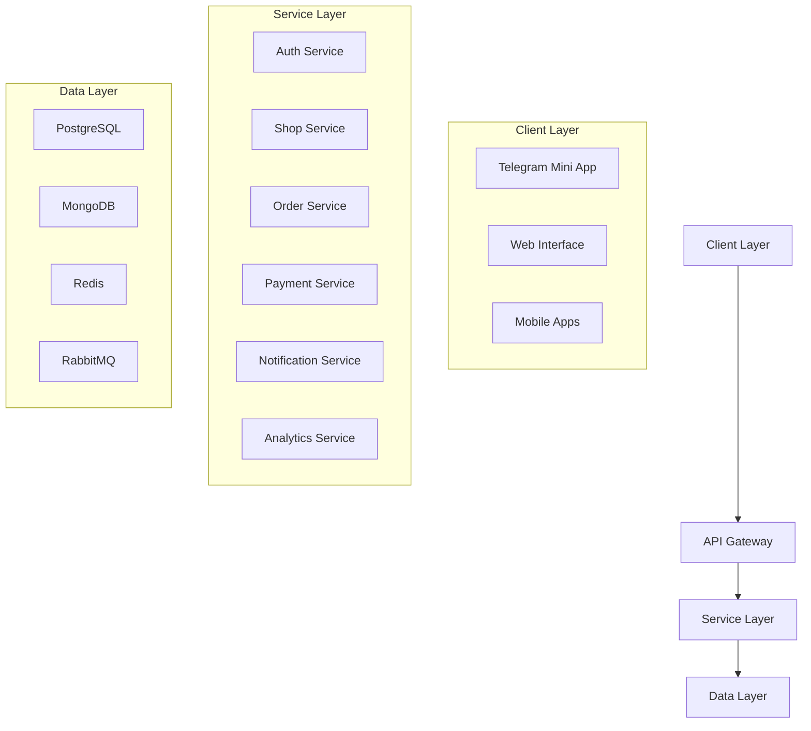
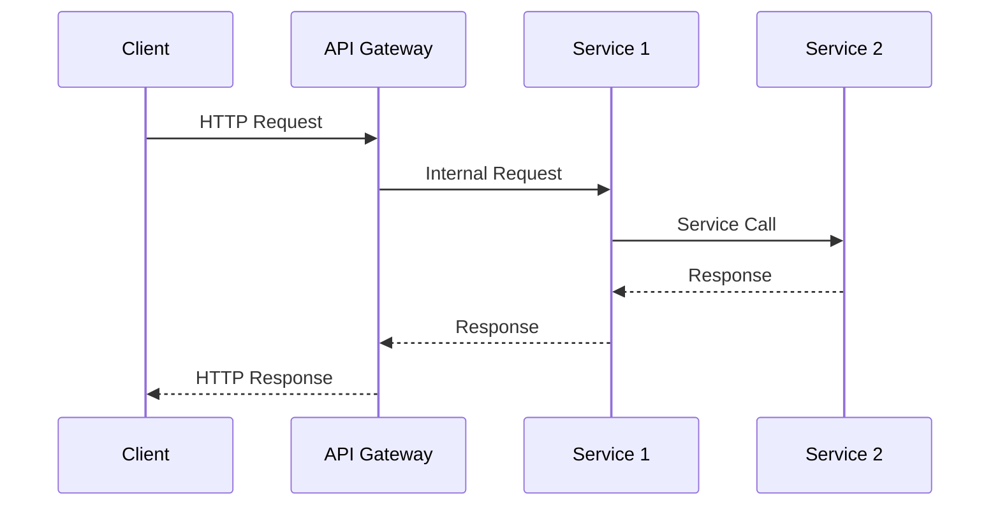
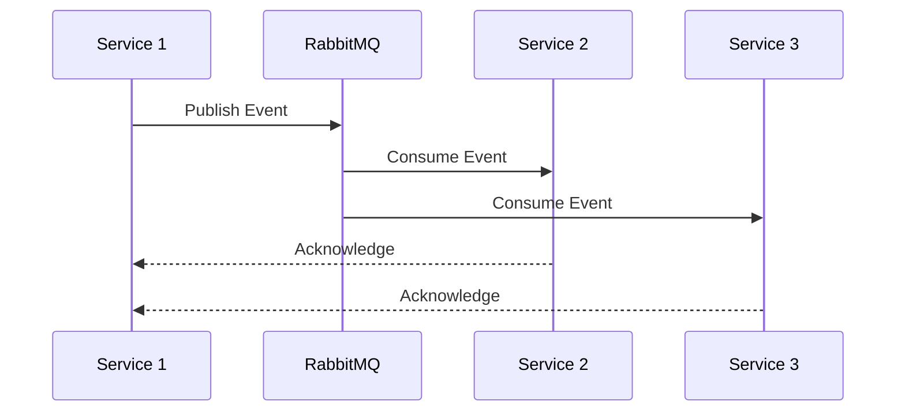

# Архитектура системы

## 1. Общая структура



## 2. Компоненты системы

### 2.1 API Gateway
- Маршрутизация запросов
- Балансировка нагрузки
- Аутентификация и авторизация
- Rate limiting
- Кэширование

### 2.2 Микросервисы

#### Auth Service (auth-service)
- Аутентификация пользователей
- Управление сессиями
- Авторизация и роли
- Интеграция с Telegram Auth

#### Shop Service (shop-service)
- Управление магазинами
- Каталог товаров
- Шаблоны и настройки
- Поиск и фильтрация

#### Order Service (order-service)
- Обработка заказов
- Управление корзиной
- История заказов
- Статусы и отслеживание

#### Payment Service (payment-service)
- Обработка платежей
- Интеграция с платежными системами
- Управление транзакциями
- Возвраты и рефанды

#### Notification Service (notification-service)
- Push-уведомления
- Email-рассылки
- Telegram сообщения
- Webhooks

#### Analytics Service (analytics-service)
- Сбор метрик
- Генерация отчетов
- Статистика продаж
- Аналитика поведения

## 3. Структура проекта

```
телега 2/
├── backend/
│   ├── services/
│   │   ├── auth-service/
│   │   ├── shop-service/
│   │   ├── order-service/
│   │   ├── payment-service/
│   │   ├── notification-service/
│   │   └── analytics-service/
│   ├── libs/
│   │   ├── common/
│   │   ├── database/
│   │   └── messaging/
│   └── gateway/
├── frontend/
│   ├── web/
│   │   ├── admin/
│   │   └── store/
│   └── telegram/
├── mobile/
│   ├── android/
│   └── ios/
└── shared/
    ├── types/
    └── utils/
```

## 4. Коммуникация между сервисами

### 4.1 Синхронная коммуникация (REST/GraphQL)



### 4.2 Асинхронная коммуникация (Events)



## 5. Технологический стек

### 5.1 Backend
- **Framework**: NestJS
- **Runtime**: Node.js
- **API**: REST + GraphQL
- **Message Broker**: RabbitMQ
- **Caching**: Redis
- **Databases**:
  - PostgreSQL (основная)
  - MongoDB (аналитика)

### 5.2 Frontend
- **Framework**: Next.js
- **State Management**: Redux Toolkit
- **UI**: Material-UI + Telegram Components
- **API Client**: Axios + React Query

### 5.3 DevOps
- **Containerization**: Docker
- **Orchestration**: Kubernetes
- **CI/CD**: GitHub Actions
- **Monitoring**: Prometheus + Grafana

## 6. Безопасность

### 6.1 Аутентификация
- JWT токены
- Telegram Auth
- OAuth 2.0
- Refresh tokens

### 6.2 Авторизация
- RBAC (Role-Based Access Control)
- Middleware для проверки прав
- Аудит действий
- Rate limiting

### 6.3 Данные
- Шифрование данных
- Защита от SQL-инъекций
- XSS защита
- CSRF токены

## 7. Масштабирование

### 7.1 Горизонтальное масштабирование
- Kubernetes автоскейлинг
- Репликация баз данных
- Распределенное кэширование
- Load balancing

### 7.2 Вертикальное масштабирование
- Оптимизация запросов
- Кэширование
- Индексирование
- Профилирование

## 8. Мониторинг

### 8.1 Метрики
- Latency
- Error rates
- Throughput
- Resource usage

### 8.2 Логирование
- Централизованные логи
- Трейсинг запросов
- Алертинг
- Дашборды

## 9. Развертывание

### 9.1 Окружения
- Development
- Staging
- Production

### 9.2 CI/CD
- Автоматическое тестирование
- Линтинг и форматирование
- Сборка и деплой
- Откат изменений 