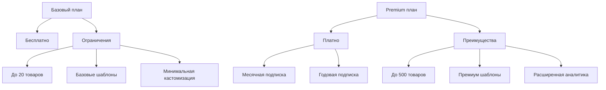

# Бизнес-модель Tele•Ga

## 1. Модель монетизации

### 1.1 Tele•Ga / Studio

#### Базовый план (Бесплатный)

- До 20 товаров
- 5-10 базовых шаблонов
- Базовая кастомизация (цвета, логотип)
- Простая аналитика просмотров
- Стандартная поддержка

#### Premium план

- До 500 товаров
- 50+ премиум шаблонов
- Расширенная кастомизация
- Детальная аналитика продаж
- Приоритетная поддержка
- Кастомные боты

### 1.2 Tele•Ga / Marketbase

#### Модель подписки

- Пробный период (1 месяц бесплатно)
- Базовый тариф
  - Ограниченное количество товаров (50)
  - Базовая видимость
  - Стандартная аналитика
- Premium тариф
  - Неограниченное количество товаров
  - Приоритетное размещение
  - Расширенная аналитика
  - Продвижение в каталоге

#### Дополнительные источники дохода

- Реклама в каталоге
- Продвижение магазинов
- Комиссия с продаж (опционально)
- Дополнительные услуги

## 2. Конкурентные преимущества

### 2.1 Уникальные особенности

- Полная интеграция с Telegram
- Единая экосистема (Studio + Marketbase)
- Простота создания и управления
- Быстрый запуск магазина

### 2.2 Отличия от конкурентов

- **vs Tilda/Shopify:**
  - Специализация на Telegram
  - Более низкий порог входа
  - Встроенный маркетплейс
- **vs Telegram боты:**
  - Комплексное решение
  - Готовые шаблоны
  - Единый каталог

## 3. Стратегия развития

### 3.1 Краткосрочные цели

1. **Первый этап**
   - Запуск базового функционала Studio
   - Интеграция с Telegram
   - Создание первых шаблонов

2. **Второй этап**
   - Запуск Marketbase
   - Система подписок
   - Базовая аналитика

### 3.2 Долгосрочные планы

#### Расширение функционала

- Интеграция с другими платформами
- Расширенные инструменты аналитики
- AI-рекомендации
- Система лояльности

#### Масштабирование

- Выход на международные рынки
- Локализация платформы
- Партнерские программы
- B2B решения

## 4. Маркетинговая стратегия

### 4.1 Каналы привлечения

- Telegram-каналы и группы
- SEO-оптимизация
- Контекстная реклама
- Партнерские программы
- Социальные сети

### 4.2 Целевая аудитория

- Малый бизнес
- Индивидуальные предприниматели
- Создатели контента
- Онлайн-магазины

## 5. Техническая реализация

### 5.1 Интеграции

- Telegram Bot API
- Telegram Mini Apps
- Платежные системы
  - Telegram Payments
  - Локальные платежные шлюзы
  - Криптовалюты (опционально)

### 5.2 Аналитика и метрики

- Просмотры товаров
- Конверсия в покупки
- Средний чек
- Активность пользователей
- ROI для рекламодателей

## 6. Риски и их минимизация

### 6.1 Технические риски

- Изменения в API Telegram
- Проблемы масштабирования
- Технические сбои

### 6.2 Бизнес-риски

- Конкуренция
- Изменения рынка
- Регуляторные риски

### 6.3 Меры предотвращения

- Гибкая архитектура
- Резервное копирование
- Юридическая поддержка
- Постоянный мониторинг рынка
