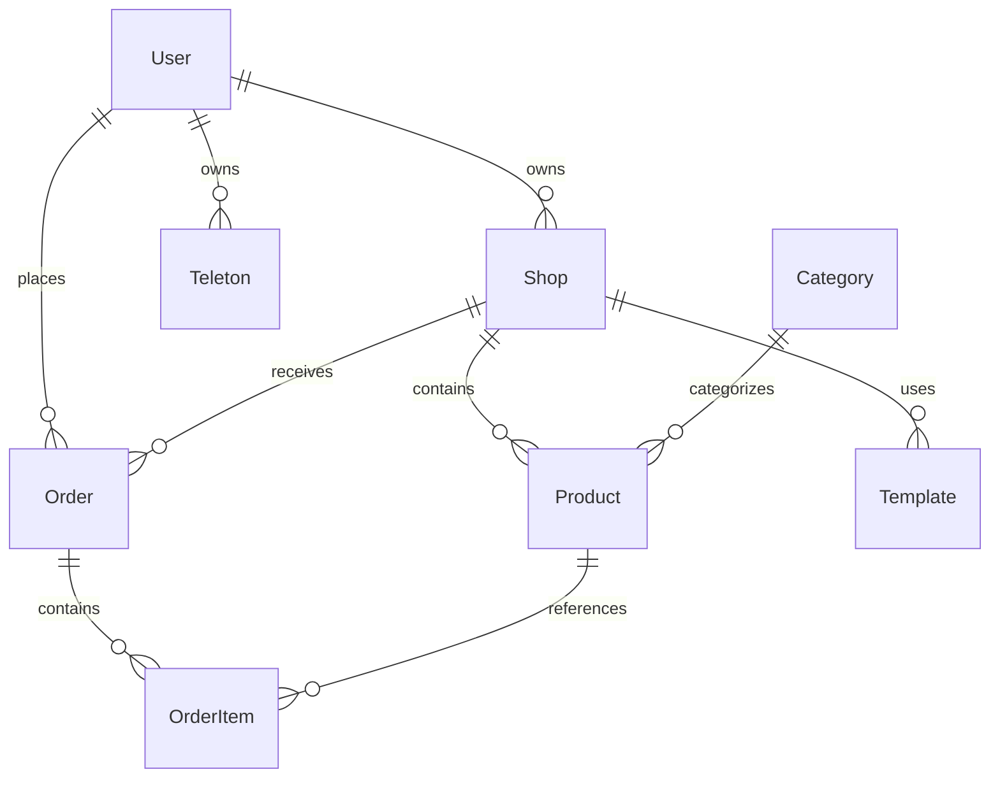

# Схема базы данных

## 1. Основные сущности



## 2. Таблицы

### 2.1 Users (Пользователи)
```sql
CREATE TABLE users (
    id UUID PRIMARY KEY DEFAULT uuid_generate_v4(),
    telegram_id BIGINT UNIQUE NOT NULL,
    username VARCHAR(255),
    first_name VARCHAR(255),
    last_name VARCHAR(255),
    phone VARCHAR(20),
    email VARCHAR(255),
    role VARCHAR(20) NOT NULL DEFAULT 'user',
    teleton_balance DECIMAL(10,2) DEFAULT 0,
    subscription_type VARCHAR(20) DEFAULT 'free',
    subscription_expires_at TIMESTAMP,
    created_at TIMESTAMP NOT NULL DEFAULT CURRENT_TIMESTAMP,
    updated_at TIMESTAMP NOT NULL DEFAULT CURRENT_TIMESTAMP
);

CREATE INDEX idx_users_telegram_id ON users(telegram_id);
CREATE INDEX idx_users_username ON users(username);
```

### 2.2 Shops (Магазины)
```sql
CREATE TABLE shops (
    id UUID PRIMARY KEY DEFAULT uuid_generate_v4(),
    owner_id UUID NOT NULL REFERENCES users(id),
    name VARCHAR(255) NOT NULL,
    description JSONB NOT NULL DEFAULT '{}',
    slug VARCHAR(255) UNIQUE NOT NULL,
    template_id UUID REFERENCES templates(id),
    settings JSONB NOT NULL DEFAULT '{}',
    status VARCHAR(20) NOT NULL DEFAULT 'active',
    subscription_type VARCHAR(20) DEFAULT 'free',
    subscription_expires_at TIMESTAMP,
    created_at TIMESTAMP NOT NULL DEFAULT CURRENT_TIMESTAMP,
    updated_at TIMESTAMP NOT NULL DEFAULT CURRENT_TIMESTAMP,
    CONSTRAINT valid_slug CHECK (slug ~* '^[a-z0-9-]+$')
);

CREATE INDEX idx_shops_owner_id ON shops(owner_id);
CREATE INDEX idx_shops_slug ON shops(slug);
```

### 2.3 Products (Товары)
```sql
CREATE TABLE products (
    id UUID PRIMARY KEY DEFAULT uuid_generate_v4(),
    shop_id UUID NOT NULL REFERENCES shops(id),
    category_id UUID REFERENCES categories(id),
    name JSONB NOT NULL DEFAULT '{}',
    description JSONB NOT NULL DEFAULT '{}',
    price DECIMAL(10,2) NOT NULL,
    currency VARCHAR(3) NOT NULL DEFAULT 'USD',
    images JSONB NOT NULL DEFAULT '[]',
    attributes JSONB NOT NULL DEFAULT '{}',
    stock_quantity INTEGER,
    status VARCHAR(20) NOT NULL DEFAULT 'active',
    created_at TIMESTAMP NOT NULL DEFAULT CURRENT_TIMESTAMP,
    updated_at TIMESTAMP NOT NULL DEFAULT CURRENT_TIMESTAMP
);

CREATE INDEX idx_products_shop_id ON products(shop_id);
CREATE INDEX idx_products_category_id ON products(category_id);
```

### 2.4 Categories (Категории)
```sql
CREATE TABLE categories (
    id UUID PRIMARY KEY DEFAULT uuid_generate_v4(),
    parent_id UUID REFERENCES categories(id),
    name JSONB NOT NULL DEFAULT '{}',
    description JSONB NOT NULL DEFAULT '{}',
    slug VARCHAR(255) NOT NULL,
    status VARCHAR(20) NOT NULL DEFAULT 'active',
    created_at TIMESTAMP NOT NULL DEFAULT CURRENT_TIMESTAMP,
    updated_at TIMESTAMP NOT NULL DEFAULT CURRENT_TIMESTAMP,
    CONSTRAINT valid_slug CHECK (slug ~* '^[a-z0-9-]+$')
);

CREATE INDEX idx_categories_parent_id ON categories(parent_id);
CREATE INDEX idx_categories_slug ON categories(slug);
```

### 2.5 Orders (Заказы)
```sql
CREATE TABLE orders (
    id UUID PRIMARY KEY DEFAULT uuid_generate_v4(),
    shop_id UUID NOT NULL REFERENCES shops(id),
    customer_id UUID NOT NULL REFERENCES users(id),
    status VARCHAR(20) NOT NULL DEFAULT 'pending',
    total_amount DECIMAL(10,2) NOT NULL,
    currency VARCHAR(3) NOT NULL DEFAULT 'USD',
    payment_method VARCHAR(50),
    payment_status VARCHAR(20) DEFAULT 'pending',
    shipping_address JSONB,
    metadata JSONB NOT NULL DEFAULT '{}',
    created_at TIMESTAMP NOT NULL DEFAULT CURRENT_TIMESTAMP,
    updated_at TIMESTAMP NOT NULL DEFAULT CURRENT_TIMESTAMP
);

CREATE INDEX idx_orders_shop_id ON orders(shop_id);
CREATE INDEX idx_orders_customer_id ON orders(customer_id);
CREATE INDEX idx_orders_status ON orders(status);
```

### 2.6 OrderItems (Позиции заказа)
```sql
CREATE TABLE order_items (
    id UUID PRIMARY KEY DEFAULT uuid_generate_v4(),
    order_id UUID NOT NULL REFERENCES orders(id),
    product_id UUID NOT NULL REFERENCES products(id),
    quantity INTEGER NOT NULL,
    price DECIMAL(10,2) NOT NULL,
    currency VARCHAR(3) NOT NULL DEFAULT 'USD',
    metadata JSONB NOT NULL DEFAULT '{}',
    created_at TIMESTAMP NOT NULL DEFAULT CURRENT_TIMESTAMP
);

CREATE INDEX idx_order_items_order_id ON order_items(order_id);
CREATE INDEX idx_order_items_product_id ON order_items(product_id);
```

### 2.7 Templates (Шаблоны)
```sql
CREATE TABLE templates (
    id UUID PRIMARY KEY DEFAULT uuid_generate_v4(),
    name JSONB NOT NULL DEFAULT '{}',
    description JSONB NOT NULL DEFAULT '{}',
    preview_image VARCHAR(255),
    config JSONB NOT NULL DEFAULT '{}',
    category VARCHAR(50),
    subscription_type VARCHAR(20) DEFAULT 'free',
    status VARCHAR(20) NOT NULL DEFAULT 'active',
    created_at TIMESTAMP NOT NULL DEFAULT CURRENT_TIMESTAMP,
    updated_at TIMESTAMP NOT NULL DEFAULT CURRENT_TIMESTAMP
);

CREATE INDEX idx_templates_category ON templates(category);
CREATE INDEX idx_templates_subscription_type ON templates(subscription_type);
```

### 2.8 Teleton (Внутренняя валюта)
```sql
CREATE TABLE teleton_transactions (
    id UUID PRIMARY KEY DEFAULT uuid_generate_v4(),
    user_id UUID NOT NULL REFERENCES users(id),
    type VARCHAR(20) NOT NULL,
    amount DECIMAL(10,2) NOT NULL,
    description TEXT,
    metadata JSONB NOT NULL DEFAULT '{}',
    created_at TIMESTAMP NOT NULL DEFAULT CURRENT_TIMESTAMP
);

CREATE INDEX idx_teleton_transactions_user_id ON teleton_transactions(user_id);
CREATE INDEX idx_teleton_transactions_type ON teleton_transactions(type);
```

## 3. Дополнительные таблицы

### 3.1 Analytics (Аналитика)
```sql
CREATE TABLE analytics_events (
    id UUID PRIMARY KEY DEFAULT uuid_generate_v4(),
    shop_id UUID REFERENCES shops(id),
    user_id UUID REFERENCES users(id),
    event_type VARCHAR(50) NOT NULL,
    event_data JSONB NOT NULL DEFAULT '{}',
    created_at TIMESTAMP NOT NULL DEFAULT CURRENT_TIMESTAMP
);

CREATE INDEX idx_analytics_events_shop_id ON analytics_events(shop_id);
CREATE INDEX idx_analytics_events_user_id ON analytics_events(user_id);
CREATE INDEX idx_analytics_events_type ON analytics_events(event_type);
```

### 3.2 Notifications (Уведомления)
```sql
CREATE TABLE notifications (
    id UUID PRIMARY KEY DEFAULT uuid_generate_v4(),
    user_id UUID NOT NULL REFERENCES users(id),
    type VARCHAR(50) NOT NULL,
    title TEXT NOT NULL,
    content TEXT NOT NULL,
    metadata JSONB NOT NULL DEFAULT '{}',
    read_at TIMESTAMP,
    created_at TIMESTAMP NOT NULL DEFAULT CURRENT_TIMESTAMP
);

CREATE INDEX idx_notifications_user_id ON notifications(user_id);
CREATE INDEX idx_notifications_type ON notifications(type);
```

## 4. Безопасность

### 4.1 Аудит
```sql
CREATE TABLE audit_logs (
    id UUID PRIMARY KEY DEFAULT uuid_generate_v4(),
    user_id UUID REFERENCES users(id),
    action VARCHAR(50) NOT NULL,
    entity_type VARCHAR(50) NOT NULL,
    entity_id UUID,
    old_values JSONB,
    new_values JSONB,
    metadata JSONB NOT NULL DEFAULT '{}',
    created_at TIMESTAMP NOT NULL DEFAULT CURRENT_TIMESTAMP
);

CREATE INDEX idx_audit_logs_user_id ON audit_logs(user_id);
CREATE INDEX idx_audit_logs_action ON audit_logs(action);
CREATE INDEX idx_audit_logs_entity ON audit_logs(entity_type, entity_id);
```

### 4.2 Сессии
```sql
CREATE TABLE sessions (
    id UUID PRIMARY KEY DEFAULT uuid_generate_v4(),
    user_id UUID NOT NULL REFERENCES users(id),
    token TEXT NOT NULL,
    device_info JSONB NOT NULL DEFAULT '{}',
    expires_at TIMESTAMP NOT NULL,
    created_at TIMESTAMP NOT NULL DEFAULT CURRENT_TIMESTAMP,
    updated_at TIMESTAMP NOT NULL DEFAULT CURRENT_TIMESTAMP
);

CREATE INDEX idx_sessions_user_id ON sessions(user_id);
CREATE INDEX idx_sessions_token ON sessions(token);
CREATE INDEX idx_sessions_expires_at ON sessions(expires_at);
```

## 5. Миграции

Для управления миграциями будем использовать TypeORM с следующими принципами:

1. Каждая миграция в отдельном файле
2. Атомарные изменения
3. Возможность отката (down migration)
4. Транзакционная безопасность
5. Проверка целостности данных

## 6. Индексы и оптимизация

1. Первичные ключи: UUID для масштабируемости
2. Внешние ключи: обязательны для связей
3. Индексы на часто используемых полях
4. Составные индексы для сложных запросов
5. Партиционирование для больших таблиц (analytics_events) 