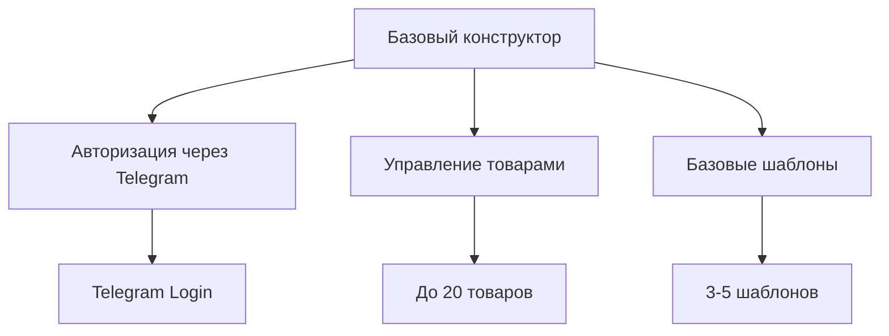
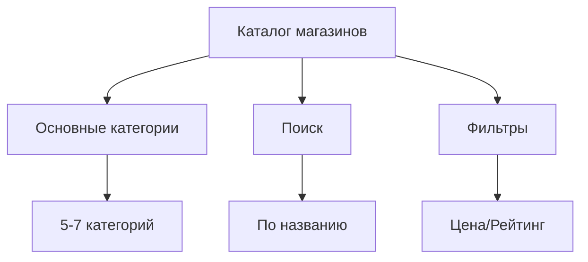
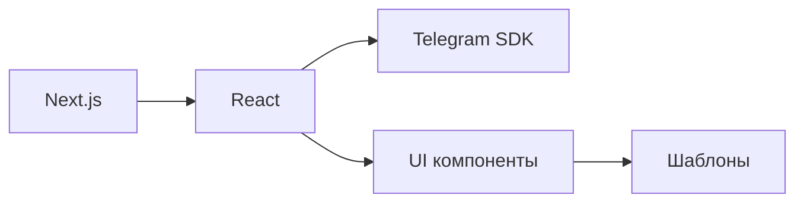

# MVP Спецификация Tele•Ga

## 1. Основные компоненты MVP

### 1.1 Tele•Ga / Studio (MVP)

#### Минимальный функционал
- Авторизация через Telegram
- Создание магазина
  - 3-5 базовых шаблонов
  - Добавление до 20 товаров
  - Базовая кастомизация
- Интеграция с Telegram Bot
  - Автоматические ответы
  - Уведомления о заказах
- Mini App интеграция
  - Просмотр товаров
  - Корзина
  - Оформление заказа

### 1.2 Tele•Ga / Marketbase (MVP)

#### Минимальный функционал
- Каталог магазинов
  - Основные категории (5-7)
  - Простой поиск
  - Базовые фильтры
- Система подписки
  - Пробный период
  - Базовый тариф
- Просмотр магазинов
  - Карточка магазина
  - Список товаров
  - Контактная информация

## 2. Приоритеты разработки

### 2.1 Первая итерация (2-3 недели)
1. **Базовая инфраструктура**
   - Настройка Next.js
   - База данных PostgreSQL
   - API endpoints

2. **Авторизация**
   - Telegram Login
   - JWT токены
   - Роли пользователей

3. **Конструктор магазина**
   - Создание магазина
   - Управление товарами
   - Базовые шаблоны

### 2.2 Вторая итерация (2-3 недели)
1. **Telegram интеграция**
   - Bot API
   - Mini Apps SDK
   - Уведомления

2. **Marketbase основа**
   - Каталог
   - Категории
   - Поиск

3. **Платежи**
   - Telegram Payments
   - Подписки
   - История транзакций

## 3. Технические требования

### 3.1 Frontend

- Next.js/React
- Telegram Mini Apps SDK
- Адаптивный дизайн
- Оптимизация производительности

### 3.2 Backend
- Node.js/Express
- PostgreSQL
- Redis для кэширования
- JWT авторизация

### 3.3 Интеграции
- Telegram Bot API
- Telegram Payments
- Telegram Login Widget

## 4. Метрики успеха MVP

### 4.1 Количественные метрики
- Количество созданных магазинов
- Количество добавленных товаров
- Конверсия в покупки
- Активность пользователей

### 4.2 Качественные метрики
- Удобство использования
- Скорость создания магазина
- Удовлетворенность пользователей
- Стабильность работы

## 5. План тестирования

### 5.1 Внутреннее тестирование
- Функциональное тестирование
- Нагрузочное тестирование
- Тестирование безопасности
- UI/UX тестирование

### 5.2 Бета-тестирование
- Закрытая группа (50-100 пользователей)
- Сбор обратной связи
- Анализ использования
- Выявление проблем

## 6. Безопасность

### 6.1 Основные меры
- Защита API
- Валидация данных
- Безопасность платежей
- Защита от DDOS

### 6.2 Соответствие требованиям
- GDPR
- PCI DSS
- Локальные требования

## 7. Поддержка пользователей

### 7.1 Документация
- Руководство пользователя
- API документация
- Часто задаваемые вопросы
- Видео-инструкции

### 7.2 Каналы поддержки
- Telegram чат
- Email поддержка
- База знаний
- Обучающие материалы 