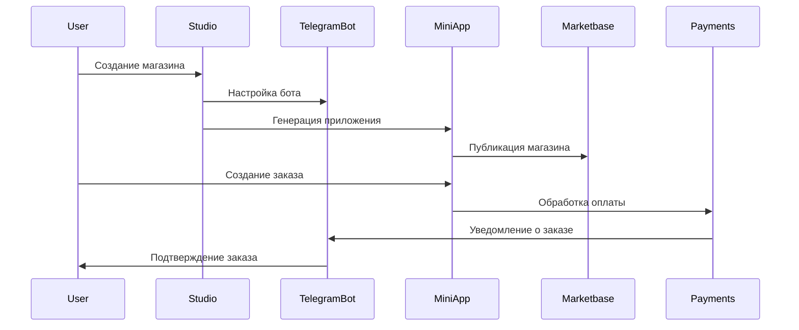

# Обзор системы Tele•Ga

## 1. Studio (Конструктор магазинов)

### 1.1 Конструктор магазинов

- **Функциональность:**
  - Создание и настройка магазина
  - Управление товарами и категориями
  - Кастомизация дизайна
  - Настройка мультиязычности
- **Технические компоненты:**
  - Next.js для веб-интерфейса
  - Drag-and-drop конструктор
  - Система шаблонов
  - Редактор контента

### 1.2 Настройка Telegram ботов

- **Функциональность:**
  - Создание и настройка бота
  - Управление автоответами
  - Настройка уведомлений
  - Интеграция с заказами
- **Технические компоненты:**
  - Telegram Bot API интеграция
  - Система шаблонов сообщений
  - Панель управления ботом
  - Аналитика взаимодействий

## 2. Telegram Mini Apps

### 2.1 Интеграция с мессенджером

- **Функциональность:**
  - Встроенный магазин в Telegram
  - Быстрый доступ к каталогу
  - Система корзины
  - Оформление заказов
- **Технические компоненты:**
  - Telegram Mini Apps SDK
  - React Native компоненты
  - Оптимизация под мобильные устройства
  - Кэширование данных

### 2.2 Управление заказами

- **Функциональность:**
  - Создание заказов
  - Отслеживание статуса
  - История заказов
  - Уведомления о статусе
- **Технические компоненты:**
  - Система очередей
  - Real-time уведомления
  - Интеграция с ботом
  - Аналитика заказов

## 3. Marketbase

### 3.1 Каталог магазинов

- **Функциональность:**
  - Листинг магазинов
  - Категоризация
  - Система поиска
  - Фильтрация
- **Технические компоненты:**
  - Elasticsearch для поиска
  - Система категорий
  - Фильтры и сортировка
  - Кэширование результатов

### 3.2 Платная подписка

- **Функциональность:**
  - Управление тарифами
  - Биллинг
  - Статистика использования
  - Управление лимитами
- **Технические компоненты:**
  - Система подписок
  - Платежный шлюз
  - Мониторинг использования
  - Автоматическое продление

## 4. Платежные системы

### 4.1 Обработка платежей

- **Функциональность:**
  - Прием платежей
  - Возвраты
  - История транзакций
  - Финансовая отчетность
- **Технические компоненты:**
  - Telegram Payments API
  - Локальные платежные шлюзы
  - Система чеков
  - Безопасное хранение данных

### 4.2 Подписки

- **Функциональность:**
  - Управление тарифами
  - Автоматические платежи
  - Уведомления
  - История подписок
- **Технические компоненты:**
  - Система рекуррентных платежей
  - Управление периодами
  - Система скидок
  - Аналитика подписок

## 5. Взаимодействие компонентов

## 6. Потоки данных

### 6.1 Создание магазина

1. Пользователь создает магазин в Studio
2. Генерируется Mini App
3. Настраивается бот
4. Магазин публикуется в Marketbase

### 6.2 Процесс покупки

1. Покупатель находит магазин
2. Оформляет заказ через Mini App
3. Производит оплату
4. Получает подтверждение через бот

### 6.3 Управление подписками

1. Владелец выбирает тариф
2. Оформляет подписку
3. Получает расширенный функционал
4. Автоматическое продление

## 7. Масштабирование

### 7.1 Горизонтальное масштабирование

- Балансировка нагрузки
- Репликация данных
- Кластеризация сервисов
- CDN для статики

### 7.2 Вертикальное масштабирование

- Оптимизация запросов
- Кэширование
- Индексирование
- Оптимизация ресурсов
