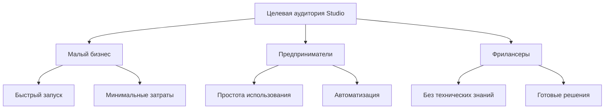
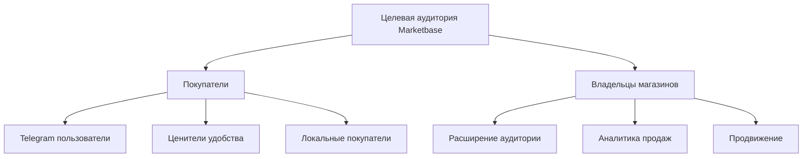
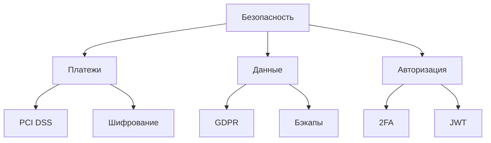

# Анализ целевой аудитории и требований

## 1. Целевые сегменты

### 1.1 Tele•Ga / Studio

#### Характеристики пользователей

1. **Малый бизнес**
   - Потребности:
     - Быстрый выход онлайн
     - Минимальные затраты
     - Простое управление
   - Ожидания:
     - Готовые шаблоны
     - Автоматизация процессов
     - Интеграция с Telegram

2. **Предприниматели**
   - Потребности:
     - Управление из телефона
     - Быстрая настройка
     - Аналитика продаж
   - Ожидания:
     - Интуитивный интерфейс
     - Поддержка 24/7
     - Масштабируемость

3. **Фрилансеры**
   - Потребности:
     - Простой старт
     - Минимум настроек
     - Готовые решения
   - Ожидания:
     - Понятная документация
     - Базовые шаблоны
     - Техподдержка

### 1.2 Tele•Ga / Marketbase

#### Характеристики пользователей

1. **Покупатели**
   - Потребности:
     - Удобный поиск
     - Быстрые покупки
     - Надежность
   - Ожидания:
     - Простой интерфейс
     - Быстрые ответы
     - Безопасные платежи

2. **Владельцы магазинов**
   - Потребности:
     - Увеличение продаж
     - Аналитика
     - Автоматизация
   - Ожидания:
     - Рост аудитории
     - Простое управление
     - Маркетинговые инструменты

## 2. Требования к продукту

### 2.1 Функциональные требования

#### Базовый функционал (Бесплатный)

- Создание магазина
  - Базовые шаблоны (5-10)
  - До 20 товаров
  - Простая кастомизация
- Интеграция с Telegram
  - Базовый бот
  - Простые уведомления
  - Автоответы
- Аналитика
  - Просмотры
  - Базовая статистика
  - Простые отчеты

#### Premium функционал

- Расширенные возможности
  - Премиум шаблоны (50+)
  - До 500 товаров
  - Полная кастомизация
- Продвинутая интеграция
  - Умный бот
  - Детальные уведомления
  - Сценарии общения
- Расширенная аналитика
  - Продажи
  - Конверсия
  - Прогнозы

### 2.2 Технические требования

#### Безопасность

1. **Платежная безопасность**
   - PCI DSS соответствие
   - Шифрование данных
   - Мониторинг транзакций
   - Защита от мошенничества

2. **Защита данных**
   - GDPR compliance
   - Шифрование в покое
   - Безопасная передача
   - Регулярные бэкапы

3. **Система авторизации**
   - Telegram Auth
   - Двухфакторная аутентификация
   - JWT токены
   - Ролевой доступ

### 2.3 Интеграции

#### Платежные системы

- Telegram Payments
- Локальные платежные шлюзы
- Криптовалюты (опционально)

#### CRM системы

- API для интеграции
- Webhook поддержка
- Экспорт данных

## 3. План развития

### 3.1 Краткосрочные цели

1. MVP запуск
   - Базовый функционал
   - Ключевые интеграции
   - Тестирование безопасности

2. Бета-тестирование
   - 50-100 пользователей
   - Сбор обратной связи
   - Оптимизация

### 3.2 Долгосрочные цели

1. Расширение функционала
   - Новые шаблоны
   - Дополнительные интеграции
   - Расширенная аналитика

2. Масштабирование
   - Международный рынок
   - Новые языки
   - B2B решения
