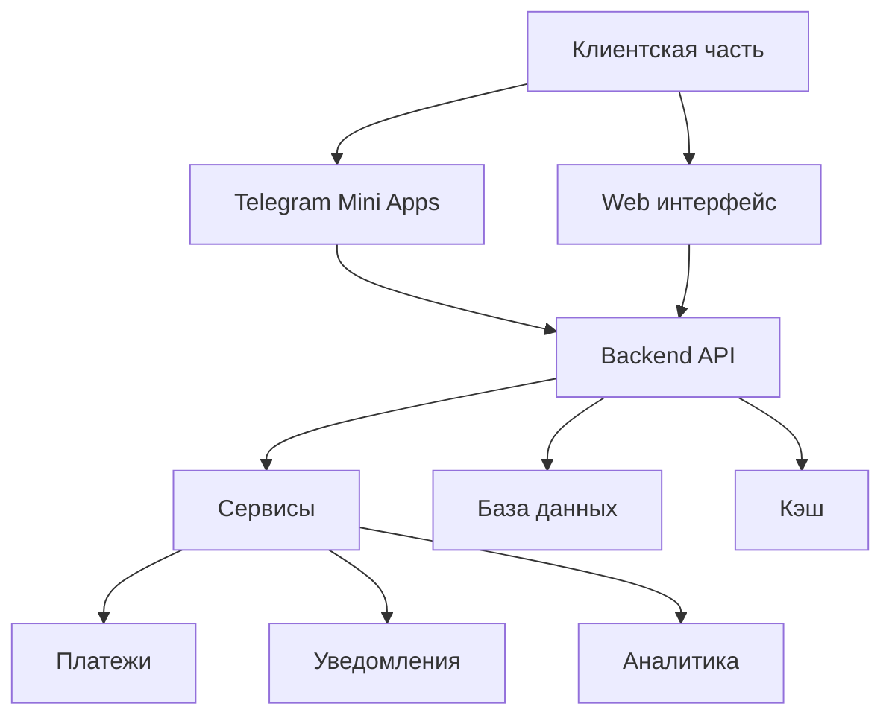
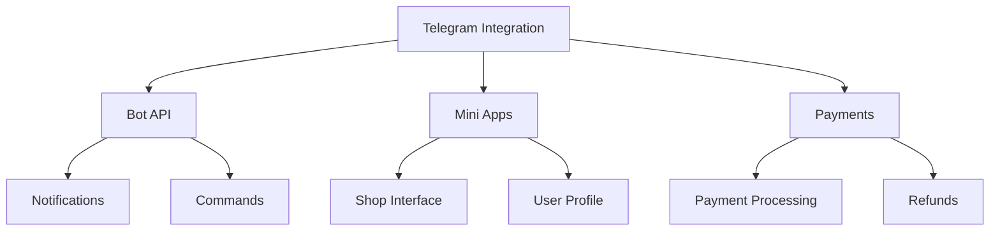
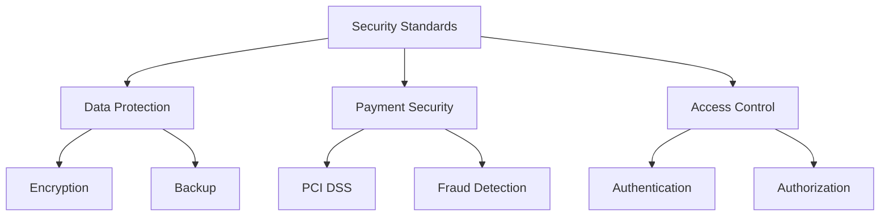

# Техническая реализация

## 1. Архитектура системы

### 1.1 Микросервисная архитектура

#### Core Services

- **Auth Service**
  - Telegram авторизация
  - JWT токены
  - Управление сессиями
  - Ролевая модель

- **Shop Service**
  - Управление магазинами
  - Товары и категории
  - Шаблоны и настройки
  - Кастомизация

- **Order Service**
  - Обработка заказов
  - Статусы и уведомления
  - История заказов
  - Возвраты

- **Payment Service**
  - Интеграция с bazucompany.com
  - Telegram Payments
  - Криптовалюты
  - Безопасность транзакций

#### Support Services

- **Analytics Service**
  - Сбор метрик
  - Отчеты
  - Статистика
  - Прогнозы

- **Notification Service**
  - Push уведомления
  - Email рассылки
  - Telegram сообщения
  - Webhooks

### 1.2 Технологический стек

#### Frontend

- **Framework**: Next.js
- **State Management**: Redux Toolkit
- **UI Components**:
  - Material-UI
  - Telegram Components
- **API**:
  - REST
  - GraphQL (опционально)

#### Backend

- **Framework**: NestJS
- **Database**:
  - PostgreSQL (основная)
  - MongoDB (аналитика)
- **Cache**: Redis
- **Message Broker**: RabbitMQ

#### DevOps

- **CI/CD**: GitHub Actions
- **Containers**: Docker
- **Orchestration**: Kubernetes
- **Monitoring**:
  - Prometheus
  - Grafana

## 2. Интеграции

### 2.1 Telegram

#### Bot API

- Автоматические ответы
- Обработка команд
- Интерактивные кнопки
- Медиа контент

#### Mini Apps

- Адаптивный дизайн
- Оффлайн режим
- Кэширование
- Оптимизация производительности

### 2.2 Платежные системы

#### bazucompany.com Integration

- API подключение
- Webhook обработка
- Безопасность транзакций
- Мониторинг платежей

#### Дополнительные платежные методы

- Криптовалюты
- Локальные платежные системы
- Банковские карты
- Электронные кошельки

### 2.3 CRM интеграции

#### API Endpoints

- REST API
- GraphQL API
- Webhook система
- Документация

#### Поддерживаемые системы

- amoCRM
- Bitrix24
- HubSpot
- Custom CRM

## 3. Безопасность

### 3.1 Стандарты безопасности

#### Защита данных

- Шифрование в покое
- Шифрование при передаче
- Регулярные бэкапы
- Аудит доступа

#### Платежная безопасность

- PCI DSS compliance
- Мониторинг транзакций
- Защита от мошенничества
- Безопасные токены

#### Контроль доступа

- Многофакторная аутентификация
- Ролевая модель
- Аудит действий
- Сессионный контроль

### 3.2 Мониторинг и логирование

#### Система мониторинга

- Real-time алерты
- Метрики производительности
- Мониторинг безопасности
- Автоматические отчеты

#### Логирование

- Централизованные логи
- Анализ поведения
- Отслеживание ошибок
- Аудит безопасности

## 4. Масштабирование

### 4.1 Горизонтальное масштабирование

#### Инфраструктура

- Kubernetes кластеры
- Load Balancing
- Auto-scaling
- Георепликация

#### Оптимизация

- Кэширование
- CDN
- Оптимизация запросов
- Индексирование

### 4.2 Отказоустойчивость

#### High Availability

- Резервные серверы
- Репликация данных
- Балансировка нагрузки
- Автоматическое восстановление

#### Disaster Recovery

- Резервное копирование
- План восстановления
- Тестирование восстановления
- Документация процессов
