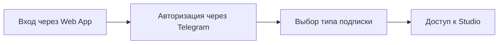
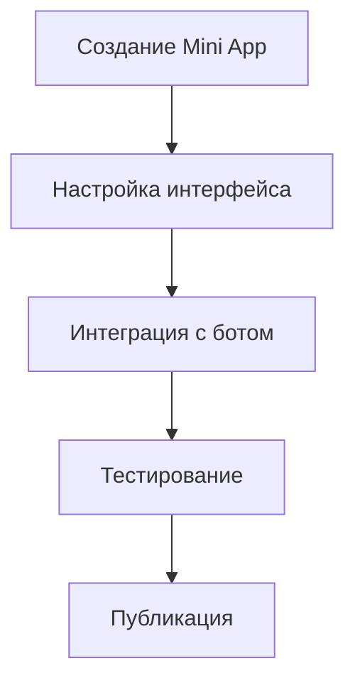
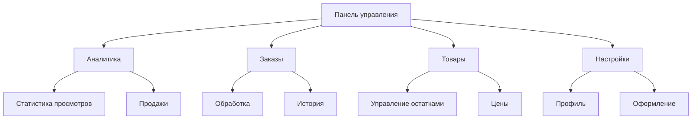
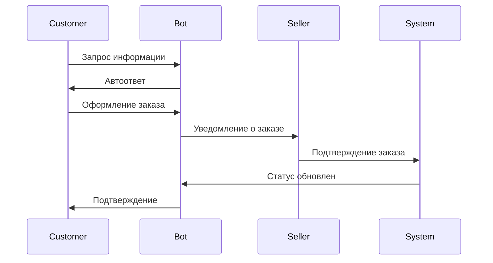

# Путь пользователя в экосистеме Tele•Ga

## 1. Создание магазина (Tele•Ga / Studio)

### 1.1 Вход в систему

### 1.2 Процесс создания магазина
1. **Выбор шаблона**
   - Базовые шаблоны (5-10 для бесплатного плана)
   - Премиум шаблоны (50+ для подписки)
   - Предпросмотр на десктопе и в Telegram

2. **Настройка дизайна**
   - Загрузка логотипа
   - Выбор цветовой схемы
   - Настройка шрифтов
   - Кастомизация элементов интерфейса

3. **Управление товарами**
   - Создание категорий
   - Добавление товаров
   - Мультиязычные описания
   - Управление ценами и наличием

4. **Настройка Telegram бота**
   - Создание автоответов
   - Настройка уведомлений
   - Шаблоны сообщений
   - Интеграция с заказами

### 1.3 Интеграция с Telegram Mini Apps

## 2. Размещение в Marketbase

### 2.1 Процесс публикации
1. **Подготовка магазина**
   - Заполнение профиля
   - Проверка товаров
   - Настройка доставки
   - Подключение платежей

2. **Выбор тарифа**
   - Пробный период (1 месяц)
   - Базовый тариф
   - Премиум размещение

3. **Настройка видимости**
   - Выбор категорий
   - Настройка тегов
   - SEO-оптимизация
   - Геолокация

### 2.2 Управление магазином

## 3. Взаимодействие с клиентами

### 3.1 Процесс покупки
1. **Поиск товара**
   - Через Marketbase
   - Через Telegram Mini App
   - По прямой ссылке

2. **Оформление заказа**
   - Добавление в корзину
   - Выбор способа доставки
   - Выбор способа оплаты
   - Подтверждение заказа

3. **Обработка заказа**
   - Уведомление продавца
   - Подтверждение наличия
   - Обработка оплаты
   - Отправка товара

### 3.2 Коммуникация

## 4. Аналитика и отчетность

### 4.1 Показатели эффективности
- Количество просмотров
- Конверсия в покупки
- Средний чек
- Повторные покупки

### 4.2 Финансовая отчетность
- Выручка
- Комиссии
- Расходы на рекламу
- Прибыль

## 5. Техническая поддержка

### 5.1 Каналы поддержки
- Чат с поддержкой
- База знаний
- Видео-инструкции
- Email-поддержка

### 5.2 Приоритеты обработки
- Критические проблемы
- Проблемы с оплатой
- Технические вопросы
- Общие вопросы 